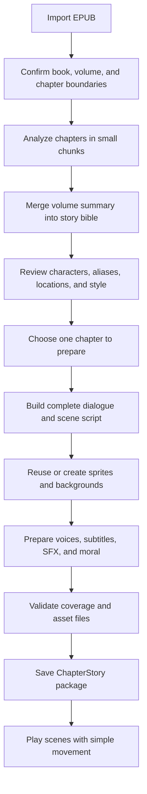

# Animated Story Mode Plan

This is the canonical plan for turning an imported EPUB into a reusable,
volume-aware Animated Story Mode. The first version uses 2D sprites, static
backgrounds, subtitles, prepared voices, sound effects, and simple movements.
It does not generate video.

## 1. Content hierarchy

StoryTale should use this hierarchy instead of storing every chapter directly
under one book:

```text
Book
-> Volume 1
   -> Chapter 1
   -> Chapter 2
-> Volume 2
   -> Chapter 1
   -> Chapter 2
```

- A normal EPUB becomes one book with one volume by default.
- A box-set EPUB may become one book with several volumes when its table of
  contents clearly contains volume headings.
- Another EPUB can be added later as the next volume of an existing book.
- Prologues, interludes, side stories, and epilogues are stored as chapters
  with a `chapterType`; they are not discarded.
- Every book, volume, and chapter has a stable ID and a separate `sortOrder`.
  Titles are not used as IDs because titles can repeat between volumes.
- If volume boundaries are unclear, the import review screen asks the user to
  confirm them instead of guessing silently.

The current `BookData -> chapters` prototype will eventually become
`BookData -> volumes -> chapters`. Existing demo books can be migrated into a
single default volume.

## 2. Local folder organization

Uploaded EPUB content belongs in app-local storage, not the bundled Flutter
`assets` directory.

```text
books/<book-id>/
|-- book.json
|-- story-bible/
|   |-- bible.json
|   |-- style.json
|   |-- entity-index.json
|   |-- characters/
|   |   `-- <character-id>/
|   |       |-- profile.json
|   |       |-- design/
|   |       |   |-- master-source.jpg
|   |       |   `-- prompt.json
|   |       `-- sprites/
|   |           |-- anchors.json
|   |           |-- master-transparent.png
|   |           |-- rig.json
|   |           |-- base-parts/
|   |           |   |-- torso.png
|   |           |   `-- <limb-part>.png
|   |           |-- outfits/
|   |           |   `-- <outfit-id>/parts/*.png
|   |           |-- poses/
|   |           |   |-- neutral.json
|   |           |   |-- talking.json
|   |           |   `-- <pose-id>.json
|   |           |-- heads/
|   |           |   |-- base.png
|   |           |   `-- expressions/
|   |           |       |-- neutral.png
|   |           |       |-- talking.png
|   |           |       |-- happy.png
|   |           |       |-- sad.png
|   |           |       `-- angry.png
|   |           `-- composites/
|   |               `-- full-neutral.png
|   |-- animals/
|   |   `-- <animal-id>/
|   |       |-- profile.json
|   |       `-- sprites/
|   |           |-- neutral.png
|   |           `-- talking.png
|   |-- plants/
|   |   `-- <plant-id>/
|   |       |-- profile.json
|   |       `-- states/*.png
|   |-- props/
|   |   `-- <prop-id>/
|   |       |-- profile.json
|   |       `-- states/*.png
|   `-- locations/
|       `-- <location-id>/
|           |-- profile.json
|           `-- backgrounds/
|               |-- day.webp
|               `-- night.webp
|-- volumes/
|   `-- <volume-id>/
|       |-- volume.json
|       |-- source/
|       |   `-- original.epub
|       |-- analysis/
|       |   `-- volume-summary.json
|       `-- chapters/
|           `-- <chapter-id>/
|               |-- chapter.json
|               |-- text/
|               |   |-- original.txt
|               |   `-- filipino.txt
|               |-- analysis.json
|               `-- story/
|                   |-- manifest.json
|                   |-- scenes.json
|                   |-- subtitles.json
|                   |-- audio/
|                   |   `-- <line-id>.wav
|                   `-- sfx/
`-- jobs/
    `-- <job-id>.json
```

The story bible is shared across all volumes. A character such as the Little
Prince keeps the same `characterId`, appearance, sprite set, and voice mapping
instead of being generated again for every chapter.

The transparent head and nine body parts are connected using the hierarchy and
pivots in `rig.json`. The approved full-body proportion uses a large chibi head
and short body, with the head wider than the shoulders.
`composites/full-neutral.png` is a reviewed preview and fallback. Clothing is
split into overlays matching the same body parts and pivots. Pose JSON changes
joint transforms without generating another picture or character ID.

## 3. Story bible

Before preparing individual chapters, StoryTale builds a reusable story bible:

```text
BookStoryBible
- bookId
- sourceFingerprint
- analysisVersion
- style: art style, palette, period, clothing rules
- characters: IDs, names, aliases, locked appearance, relationships, voice IDs
- animals and creatures: IDs, aliases, speaking role, approved sprites, voices
- plants and props: IDs, aliases, importance, approved states and focus assets
- sprite design: master sheet, design fingerprint, body variants, head
  expressions, and head anchor
- locations: IDs, specific place names, parent settings, source-backed
  background briefs, and time/weather variants
- timeline: important events ordered by volume and chapter
- unresolvedItems: names, speakers, or locations that need review
```

The story bible prevents character appearance, names, voices, locations,
animals, plants, and important objects from changing unexpectedly between
chapters or volumes. Reliable entities may be approved automatically after
deterministic source, confidence, alias, and conflict checks. Uncertain items
still require review. An approved entity may become eligible for generation,
but generated designs, sprites, backgrounds, and voices remain separately
reviewed and locked. Later Gemini analysis may add aliases, relationships, an
outfit, or a story-required state variant but must not overwrite an approved
design, sprite, or voice without confirmation.
The complete entity types, minimal asset rules, and safe fallback are defined in
[Story Bible Entity and Asset Plan](STORY_BIBLE_ENTITY_ASSET_PLAN.md).

## 4. Gemini story-analysis pipeline

The selected analyzer is Gemini. StoryTale uses this exact boundary:

```text
EPUB parser
-> cleaned chapter text with stable source block IDs
-> Gemini story-analysis API
-> JSON Schema validation
-> structured ChapterAnalysis data
```

Gemini does not receive the whole series in one request. For each chapter,
StoryTale sends the cleaned chapter text plus a compact, approved registry of
existing entity IDs, aliases, locked appearances, locations, and recent
timeline facts. Gemini must return either an existing ID or a typed candidate
such as `newHumanCandidate`, `newAnimalCandidate`, `newPlantCandidate`, or
`newPropCandidate`; it cannot replace a locked design.

Use the stable model configured by `GEMINI_MODEL` in `.env`, currently
`gemini-3.5-flash`. The request uses Gemini structured output with a JSON
Schema. The app still validates IDs, source ranges, ordering, and semantic
rules because schema-valid JSON can still contain incorrect story facts.

The root `.env` is local-development input for a service layer, not a Flutter
asset. The Gemini key must move to a server-side proxy or Worker secret before
the app is distributed.

### Reading a large book safely

A long book or series should not be sent as one very large prompt. Use a
hierarchical two-pass analysis:

1. Parse the EPUB table of contents and spine.
2. Normalize each chapter while preserving paragraph numbers and source order.
3. Analyze each chapter separately for humans, animals, creatures, plants,
   props, aliases, dialogue speakers, locations, time changes, plot beats, and
   chapter summary.
4. Normalize locations into specific scene-ready places. Keep broad worlds,
   planets, kingdoms, forests, and oceans as context unless the source supports
   a concrete place where a scene occurs.
5. Automatically approve only high-confidence, source-backed, conflict-free
   entities.
6. Merge chapter results into one volume summary.
7. Merge volume summaries into the shared book story bible.
8. Flag conflicting aliases, uncertain speakers, broad-only locations, and
   unclear volume boundaries
   for user review.

When a new volume is imported, analyze only that volume and merge its results
into the existing bible. Do not reprocess every older volume unless the
analysis format changes or the user requests a rebuild.

Gemini is implemented behind a `StoryAnalysisProvider` adapter so the rest of
the app depends only on validated `ChapterAnalysis` data. DeepL remains only
for English-to-Filipino translation. Gemini 3.1 Flash Image creates reviewed
character sprites, while Cloudflare Workers AI creates backgrounds only. Both
image routes pass through the private rate-limited Worker. A manually prepared
JSON fixture should still exist for deterministic offline tests.

## 5. Chapter boundaries and full text coverage

Every chapter stores its exact start and end:

```text
ChapterSourceRange
- spineItemStart
- spineItemEnd
- firstContentBlock
- lastContentBlock
- sourceTextHash
```

- The first real paragraph must become the first narration/dialogue line.
- The last real paragraph must become the final line before the moral screen.
- No scene may accidentally include text from the next chapter or volume.
- Headings, footnotes, illustrations, and navigation text are classified during
  import so they are not mistaken for dialogue.
- The MVP keeps the complete normalized chapter text in order. Visual
  backgrounds change only at important story beats, so full narration does not
  require a new image for every paragraph.
- Background coverage is not fixed to one image per chapter. Each explicit
  location change starts a new cutscene background, while a meaningful
  time/weather/condition change selects another state of the same location.
- Consecutive shots in one unchanged place reuse the same background. Camera,
  layout, focus assets, and sprite movement create variation without inventing
  another setting.
- Every background must be a wide, grounded visual-novel stage with open
  left/center/right sprite lanes. Square illustrations, isolated objects,
  floating islands, portrait compositions, and miniature dioramas are invalid.
  The complete contract, prompt order, provider migration, review flow, and
  acceptance checks are defined in the
  [Visual-Novel Background Plan](VISUAL_NOVEL_BACKGROUND_PLAN.md).
- A coverage validator compares all source block IDs with all scripted line
  ranges. Missing or duplicated blocks keep the chapter in `needsReview`.

## 6. Character, dialogue, and plot analysis

For each chapter, create `analysis.json` containing:

```text
ChapterAnalysis
- chapterId and sourceTextHash
- appearingCharacterIds
- newCharacterCandidates
- dialogue: source range, text, speakerId, confidence
- plotBeats: source start/end, locationId, backgroundStateId, time, summary
- requiredBackgrounds: ordered distinct locationId + backgroundStateId pairs
- requiredSpriteExpressions
- moralCandidate
- unresolvedItems
```

Dialogue speaker rules:

- Use stable character IDs from the story bible, not display names.
- Narrative text belongs to the narrator voice.
- An uncertain quoted line is marked `speakerId: unresolved`; it is not silently
  assigned to the narrator or the nearest character.
- The review step can merge aliases, choose a speaker, or create a new
  character before audio is generated.

## 7. Turning a chapter into scenes

A scene is a visual grouping of consecutive story lines, not a summary that
replaces the chapter text. Start with roughly 4-10 visual scenes per chapter,
but allow more for long chapters.

Playback uses `Chapter -> Cutscene -> Shot -> Beat`. A cutscene keeps one
location and continuous event, a shot keeps one camera/character layout, and a
beat shows one short subtitle/audio line. The approved visual-novel layouts,
movement IDs, analyzer rules, and reference prompts are defined in the
[Visual-Novel Scene Library](ANIMATED_STORY_SCENE_LIBRARY.md).

Location and background rules apply to every imported EPUB:

1. Resolve the active place from each plot beat's source blocks.
2. Prefer an existing Story Bible location when aliases and evidence match.
3. Create a new location candidate only for a specific place where the scene
   occurs.
4. Start a new cutscene when the active place changes.
5. Use a new background state when time, weather, season, damage, or another
   supported visual condition meaningfully changes the same place.
6. Reuse the current background for consecutive shots in the same place and
   state.
7. Reject a plan that skips an explicit place transition or invents an
   unsupported location.

```text
StoryScene
- sceneId and sortOrder
- sourceStartBlock and sourceEndBlock
- locationId and backgroundAssetId
- characterLayers: characterId, rigId, poseId, faceProfileId, faceSetId,
  outfitId, position, movement; legacy faceExpressionId remains readable
- lines: lineId, type, speakerId, English/Filipino text, audioAssetId
- transition: none, fade, or slide
- soundEffectIds
```

Allowed MVP movements stay small and reusable:

- enter/exit left or right
- slide to a fixed stage position
- fade in/out
- gentle bounce
- small scale pulse
- idle breathing

Characters normally fill about 75% of the camera height. The player shows one
short beat at a time instead of placing several paragraphs in one subtitle box.

The player renders these instructions dynamically. It does not create a
different Flutter page for each chapter.

## 8. Consistent transparent sprite workflow

1. Gemini story analysis identifies a new character and creates a descriptive
   candidate; it does not silently replace approved artwork.
2. The user reviews the description, palette, clothing, proportions, and style.
3. Use `gemini-3.1-flash-image` once to generate one front-facing full-body
   master on flat green. Attach the full-proportion, approved-head, and
   approved-body references through the private Worker.
4. Keep that approved master sheet for every later volume. Do not generate the
   same character again per chapter.
5. Remove the green background locally and save `master-transparent.png`.
6. Keep the neutral master as the alignment reference, then split that exact
   image into the head and nine body parts. Save each cropped part's original
   position, parent, pivot, size, and layer order in `rig.json`.
7. Rejoin the parts locally as `composites/full-neutral.png` and reject the rig
   if it no longer matches the approved master. A new outfit adds overlays for
   those same parts and pivots; ordinary emotions change only the face layer.
8. Save the prompt, seed when available, model, hash, version, review state,
   and source/license note.

Gemini supplies only the full-body master. StoryTale removes the requested flat
green background locally, splits that exact result into reusable head/body
layers, and creates the rejoined preview without another API request. The
Cloudflare Worker is a
secure gateway for Gemini sprite calls, while its `flux-1-schnell` binding
creates chapter backgrounds only.

Reference-guided generation improves shape and style consistency but does not
guarantee it. Consistency still comes from approving one master sheet, locking
its design fingerprint, splitting it into reusable body/head layers, and never
regenerating that character for a later volume.

## 9. Audio, subtitles, and moral

- Each scripted line has one speaker, subtitle, and prepared audio reference.
- Narration uses the narrator profile; character lines use their saved
  `voiceId` from the story bible.
- English and cached DeepL Filipino subtitles share the same `lineId` so the
  player can switch languages without losing its position.
- Audio is generated and cached per line or small group of consecutive lines.
- The moral is created from the current chapter only, appears after the final
  scene, and remains editable before the chapter is marked ready.
- Background music is standby and excluded from the MVP preparation pipeline.
  Keep an optional `musicAssetId` field for later, but do not block chapter
  readiness when it is null. Sound effects remain optional.

## 10. Preparation states and rebuilding

Use clear resumable states:

```text
notAnalyzed -> analyzing -> needsReview -> assetsMissing
-> generatingAudio -> validating -> ready
```

Any stage may become `failed`, and a ready chapter may become `stale`.

`manifest.json` records these fingerprints:

- original chapter text
- translation
- analysis format and prompt version
- Gemini model and analysis schema version
- story bible version
- selected sprite/background files
- voice model and pitch
- generated audio

Only the affected stage is rebuilt. Changing a voice regenerates audio but not
sprites. Replacing a background updates scenes but not dialogue. Editing one
chapter does not invalidate the rest of a large volume.

## 11. Preparation and playback flow



Large books are prepared on demand. Importing 20 volumes should build their
indexes and story-bible summaries, but it should not immediately generate
every image and audio file.

## 12. Failure and storage rules

- Missing analysis: normal EPUB reading still works.
- Uncertain speaker: pause preparation for review; keep the line visible.
- Missing sprite or focus asset: hide the layer and use a background/detail
  shot; never substitute an unrelated prototype actor.
- Missing background: use the book's default background.
- Missing voice: play narration with the default narrator or subtitles only.
- Failed image request: keep manual Replace available.
- Interrupted job: resume from the last completed stage using `jobs/<job-id>`.
- Storage cleanup removes generated chapter packages, never the original EPUB,
  accepted story bible, or user-provided images without confirmation.

## 13. Implementation order

### Phase 1 - Data and storage

- Replace the prototype EPUB button with real file picking and parsing.
- Add `VolumeData`, stable IDs, source ranges, and local repositories.
- Migrate current demo books to one default volume.
- Save/load `book.json`, `volume.json`, and `chapter.json`.

### Phase 2 - EPUB boundaries

- Parse EPUB navigation and spine order.
- Detect prologue, chapters, epilogue, and clear volume headings.
- Add a boundary review screen for uncertain imports.

### Phase 3 - Gemini analysis contract

- Define JSON models for story bible, chapter analysis, scenes, and manifests.
- Add the Gemini `StoryAnalysisProvider` using structured JSON output.
- Send one cleaned chapter plus the compact approved story-bible registry.
- Validate source ranges and prevent changes to locked character designs.
- Keep one manually authored result for deterministic offline tests.
- Classify humans, animals, creatures, plants, props, and locations separately.
- Resolve aliases before adding a typed candidate to the story bible.
- Reject any plan that uses an asset belonging to a different entity.

### Phase 4 - Review and asset reuse

- Build entity/alias, speaker, location, and art-style review screens.
- Generate and approve one Gemini full-body master per character.
- Generate only narratively important animal, creature, plant, and prop assets;
  do not generate an image for every noun.
- Attach locked shape and approved-design references to each Gemini request.
- Add local transparent sprite cleanup and validation.
- Split the approved master into the head and nine transparent body parts.
- Record the hierarchy, pivots, neutral placement, and layer order in `rig.json`.
- Complete Sprite Studio with consistent pointer selection, fixed layer rules,
  a non-scrolling canvas/inspector layout, direct bone controls, a five-face
  default catalog, and named app-local poses.
- Derive bone controls from each rig's existing hierarchy and pivots; save only
  the resulting transforms, never editor bone graphics.
- Keep Neutral, Talking, Happy, Sad, and Angry as the minimal expression IDs,
  with Neutral as the required fallback.
- Save reusable poses as validated transforms in JSON instead of new body
  pictures. See [Sprite Studio plan](SPRITE_STUDIO_PLAN.md).
- Connect approved sprites/backgrounds to stable asset IDs.
- Implement landscape background briefs, Cloudflare generation, review, and
  cutscene reuse from the
  [Visual-Novel Background Plan](VISUAL_NOVEL_BACKGROUND_PLAN.md).
- Add whole-sprite animal/creature characters and plant/prop focus assets before
  enabling final book-specific scene plans.

### Phase 5 - Audio and package builder

- Split all chapter text into ordered narrator/dialogue lines.
- Generate/copy subtitles and prepared voices.
- Validate source coverage and write the final `manifest.json`.

### Phase 6 - Dynamic player

- Load one chapter package.
- Synchronize line audio, subtitles, sprite layers, and movements.
- Support previous, pause/play, next, chapter contents, language, and moral.
- Persist scene position and completed status locally.

Prototype validation is complete for ordered full-chapter source coverage,
4-10 generated scene groups, all five starter actor profiles, the four approved
poses, and modular speaking/emotion fallbacks. Generated book-specific
characters and synchronized audio remain later Phase 4/5 work.

### Phase 7 - Volume-scale testing

- Import a standalone EPUB, a box-set EPUB, and two separately imported
  volumes grouped under one book.
- Confirm recurring characters reuse the same sprite and voice.
- Confirm duplicate chapter titles do not collide.
- Interrupt and resume preparation.
- Confirm a changed voice rebuilds audio only.
- Confirm a missing image/audio file uses the documented fallback.

## 14. MVP completion checklist

Animated Story Mode is functionally complete for the first version when:

- one EPUB can be imported as a volume with correct chapter boundaries;
- a second volume can join the same book without losing existing assets;
- the story bible lists reviewed humans, animals, creatures, plants, props,
  aliases, locations, assets, and voices;
- one full chapter is converted into ordered lines and visual scenes;
- the first and last source blocks are included exactly once;
- accepted sprites/backgrounds are reused across chapters;
- a missing non-human asset never causes an unrelated human actor to appear;
- voice audio, subtitles, simple movement, and the moral play in order;
- preparation resumes after an app restart; and
- normal reading still works when any Story Mode stage fails.

## 15. First integration fixture

Use this local, Git-ignored EPUB as the first end-to-end parser and analyzer
test:

```text
docs/ui-concepts/ui/
Mushoku_Tensei_-_Volume_09_Seven_Seas_Kobo.epub
```

Verified fixture facts:

- title: `Mushoku Tensei: Jobless Reincarnation Vol. 9`
- author: `Rifujin na Magonote`
- language: `en`
- size: 15.05 MB
- archive entries: 49
- EPUB table-of-contents entries: 22

Expected first import result:

- one book/series record with one volume numbered 9;
- 11 numbered chapters;
- 3 side stories and 1 extra chapter stored with distinct `chapterType` values;
- color inserts, title/copyright/contents pages, author information, and the
  newsletter classified as front/back matter, not normal Story Mode chapters;
- one selected chapter cleaned into stable source blocks and sent to Gemini;
- validated `ChapterAnalysis` JSON saved locally without generating music; and
- character candidates merged into the locked book story bible before any
  sprite generation.
