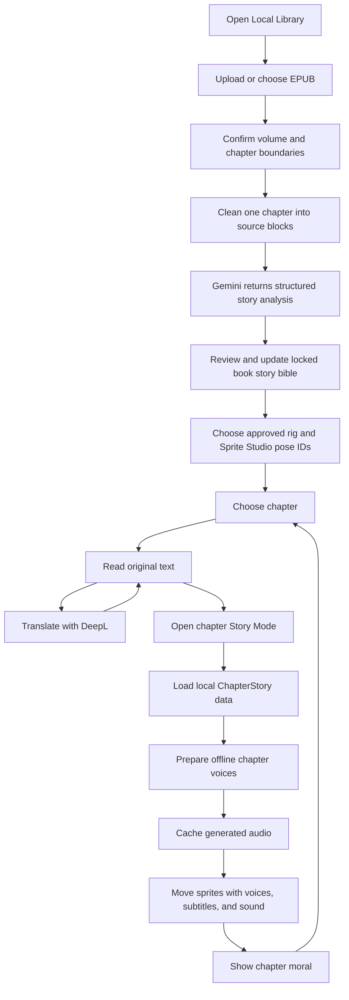

# StoryTale App Flow

## Fallbacks

- No internet: saved books, progress, installed voice models, and cached translations still work.
- DeepL fails: keep the original chapter and allow retry.
- Voice model is missing or fails: keep reading and subtitles available; do not block the chapter.
- Story data is missing: keep normal reading available.
- Volume boundary or dialogue speaker is uncertain: request review before
  preparing Story Mode; do not block normal reading.
- Sprite is missing: show a simple placeholder image.

See [Animated Story Mode plan](ANIMATED_STORY_MODE_PLAN.md) for the full preparation pipeline.
