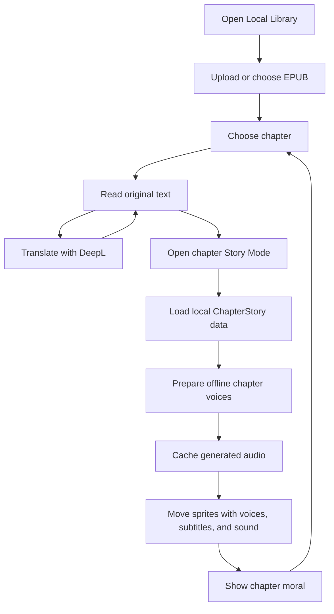

# StoryTale App Flow

## Fallbacks

- No internet: saved books, progress, installed voice models, and cached translations still work.
- DeepL fails: keep the original chapter and allow retry.
- Voice model is missing or fails: keep reading and subtitles available; do not block the chapter.
- Story data is missing: keep normal reading available.
- Sprite is missing: show a simple placeholder image.
