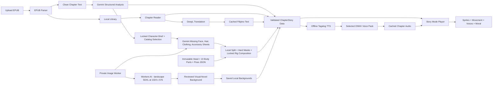

# StoryTale Architecture

This document owns system boundaries and provider responsibilities. It does not
own development status. See the [Master Roadmap](ROADMAP.md) for the current
phase and complete remaining work.

## Simple flow



## Main parts

| Part | Short purpose |
| --- | --- |
| Flutter app | Shows dynamic books, chapters, reader, and Story Mode screens. |
| EPUB importer | Accepts `.epub` only and extracts cover, title, author, and chapters. |
| Local storage | Saves EPUBs, progress, translations, chapter data, sprites, and settings on the device. |
| DeepL service | The only translation API. It translates English chapter text into Filipino. |
| Gemini analyzer | A resumable volume job sends one cleaned chapter at a time with the compact story-bible registry, then merges every validated result into one volume inventory. |
| Offline TTS engine | Runs a Tagalog ONNX TTS model inside the app without depending on Android voices. |
| Tagalog base model | Uses the Meta MMS Tagalog model, converted to ONNX, to create correctly pronounced source audio. |
| Voice packs | Stores five selected RVC voices as ONNX models installed with the app. Only the active voice is loaded into memory. |
| Audio generator | Creates narration in the background and caches completed chapter audio for smooth playback. |
| Book story bible | Locks recurring humans, animals, creatures, plants, props, appearances, aliases, locations, assets, and voices across all volumes. |
| Volume preparation coordinator | Tracks analysis, entity merging, shared assets, chapter assembly, validation, progress, pause/resume, and failures for the complete imported volume. |
| Visual entity catalog | Maps each story subject to its own approved sprite, state, rig, focus asset, or background ID and prevents unrelated substitutions. |
| ChapterStory data | Stores the sprites, dialogue, movements, sounds, and moral for one chapter. |
| Story Mode player | Moves sprites over backgrounds while playing voices, subtitles, and sound effects. |
| Gemini image model | Uses `gemini-3.1-flash-image` to create only aligned face, front/back hair, one canonical clothing-only sheet, loose-garment, and accessory components for a locked local rig. It never creates the runtime head, body geometry, or poses. |
| Cloudflare Image Worker | Private gateway that keeps the Gemini key server-side, validates sprite-component requests, and routes backgrounds to Workers AI. The current shared three-per-minute sprite throttle is an app setting to remove or disable in Phase 7G.1. |
| Workers AI | The visual-novel route uses `@cf/stabilityai/stable-diffusion-xl-base-1.0` with explicit `1024 x 576` dimensions. |
| Location background catalog | Saves one generated image per required location/state pair, keeps it pending during review, and registers its stable asset ID only after approval. |
| Local sprite processor | Removes edge-connected green, cuts fixed-layout component sheets through a versioned crop manifest, hard-masks generated layers, and validates alignment without altering the locked local head, body parts, anchors, or poses. |
| Layered character composer | Combines the shared rig with skin tint, modular face parts, back/front hair, per-part clothing, garment extensions, and anchored accessories using named layer slots. |
| Book human catalog | Stores one stable design brief, shared rig-template ID/version/hash, modular face profile, hair, outfit overlays, accessory attachments, existing voice mapping, pose proof, and validation status for every approved human. |
| Sprite Studio | Edits compatible rigs and named poses with precise joint transforms, validated layer rules, and local pose storage. |
| Book Characters review | Read-only proof page showing the neutral character, ten parts, six faces, and four pose composites without regeneration controls. |

## Dynamic chapter data

The planned hierarchy is `Book -> Volume -> Chapter -> ChapterStory`. A
single-volume EPUB receives one default volume, while additional EPUBs can be
grouped under the same book. Every chapter can have one `ChapterStory` object:

```text
ChapterStory
- chapterId
- title
- moral
- cutscenes: continuous location/time/event groups
- shots: approved layoutId, background, camera preset/target/trigger, and transition
- beats: one short subtitle/audio line in exact source order
- characterLayers: characterId, rigId, poseId, faceProfileId, faceSetId,
  outfitId, stage slot, scale, facing, depth, and movement
- focusAssetLayers: entityId, assetId, variantId, stage slot, scale, depth, and
  movement for animals, plants, creatures, and props
```

The UI reads this data, so we do not create a separate Flutter screen for every book or chapter.

`humanoid_v1` is the approved V1 geometry template. Each book character keeps
the ten total local rig parts (one head plus nine body pieces), anchors, and
pose contract unchanged, then adds its own face, front/back hair, clothing,
loose-garment, and accessory layers.
A character appearance stores front hair, optional back hair, per-style hair
X/Y/scale fits, and skin tone once for every pose. `None` is a valid back-hair
selection and never deletes the reusable back-hair catalog.
A future body proportion requires another manually approved template/version;
Gemini never invents a runtime rig. Story Mode resolves the appearance IDs
dynamically and falls back to that same character's Neutral face/pose when an
optional selection is missing. An incompatible package is hidden while
subtitles continue.

The production contract for creating and proving those generated rigs is in
[Generated Character Pipeline Plan](GENERATED_CHARACTER_PIPELINE_PLAN.md).
The exact clothing-only request, fixed crop manifest, local processing, and
outfit package are in
[Character Clothing Sheet Plan](CHARACTER_CLOTHING_SHEET_PLAN.md).

Character identities, aliases, appearances, voices, and locations live in one
book-level story bible so they can be reused across chapters and volumes. See
[Animated Story Mode plan](ANIMATED_STORY_MODE_PLAN.md) for the complete data,
analysis, generation, and validation flow. See the
[Volume Preparation Plan](VOLUME_PREPARATION_PLAN.md) for whole-volume
orchestration, progress, reusable assets, readiness, and repair behavior. See
the
[Visual-Novel Scene Library](ANIMATED_STORY_SCENE_LIBRARY.md) for the approved
shot layouts, movements, subtitle rules, and analyzer choices. Non-human
subjects and important objects follow the
[Story Bible Entity and Asset Plan](STORY_BIBLE_ENTITY_ASSET_PLAN.md).

## Chosen setup

| Need | Choice |
| --- | --- |
| App data | Local device storage first; no Supabase |
| Translation | DeepL API only |
| Story analysis | Gemini `gemini-3.5-flash` with structured JSON output |
| DeepL allowance | Current account shows 1,000,000 included characters per usage period |
| Filipino target code | `TL` |
| TTS runtime | `sherpa-onnx` / ONNX Runtime inside Flutter |
| Tagalog voice | Meta MMS Tagalog TTS converted to ONNX |
| Character voices | Five selected RVC `.pth` models converted to `.onnx` voice packs |
| Voice processing | On-device, generated before playback, then cached locally |
| Story Mode | Sprites and simple movements |
| Sprite creation | Catalog-first local composition plus about three Gemini `gemini-3.1-flash-image` component-sheet calls per missing human: face, front/back hair, and nine-part clothing; one optional accessory call only when source-supported |
| Background creation | Cloudflare SDXL visual-novel stages at `1024 x 576`, validated before local approval |
| Sprite transparency | Local green removal and hard masks; generated overlays use the locked template canvas, positions, anchors, and joint pivots |
| Image storage | Save accepted sprites and backgrounds on the device |

Gemini API image generation uses the project owner's billed server-side key.
A public release therefore needs user authentication, deduplication, provider
quota handling, billing alerts, and a spending policy. Private development
must not keep the current shared three-per-minute StoryTale sprite bottleneck,
but no architecture can promise unlimited Cloudflare or Gemini capacity.
`gemini-3.1-flash-lite-image` is cheaper but is not the default because the full
Flash Image model handles multiple references and character consistency better.

## On-device voice flow

Current prototype: `tool/run_storytale.ps1` first scans the five raw role
folders, validates each `.pth` plus `.index`/`.model` pair, and creates
fingerprinted chapter audio plus a voice manifest before Flutter starts. RVC
pitch comes from `models/voices/voice_settings.json`; Heroine and Hero default
to `+16`. Web and mobile play those prepared files, so a changed model or pitch
gets a new audio filename instead of reusing browser cache.

```text
Story text
-> optional cached DeepL Filipino translation
-> offline Tagalog TTS model
-> selected RVC ONNX voice pack
-> local audio file
-> Story Mode playback
```

- Voice-Models.com `.pth` files cannot run directly in Flutter; every selected model must pass ONNX conversion and a sound test first.
- The app installs five named voice packs: narrator, heroine, hero, deep character, and elder/extra.
- Generate audio sentence by sentence as a background chapter-preparation job.
- Load one character voice at a time and unload it after its lines are generated.
- Save generated audio so replaying a chapter does not rerun the models.
- If voice preparation fails, normal reading and subtitles remain available.
- Start by proving one voice on the target Android phone, then add the remaining four after measuring speed, memory, storage, and sound quality.

The planned offline runtime is [sherpa-onnx](https://k2-fsa.github.io/sherpa/onnx/flutter/pre-built-app.html). The Tagalog base is [Meta MMS Tagalog TTS](https://huggingface.co/facebook/mms-tts-tgl). RVC voice packs use the project's [ONNX exporter](https://github.com/RVC-Project/Retrieval-based-Voice-Conversion-WebUI/blob/main/infer/modules/onnx/export.py).

## DeepL setup

DeepL supports Tagalog through API target code `TL`. StoryTale sends translation requests only when online, then caches the result. DeepL remains the only translation provider.

## Gemini story analysis

```text
EPUB parser -> cleaned chapter text -> Gemini story-analysis API
-> JSON Schema validation -> structured story data
```

Analysis is per chapter, not one request for the entire book. Each request also
includes a compact approved registry from the book story bible. Gemini may link
an existing typed entity or propose a candidate, but it cannot replace a locked
appearance, sprite design, asset, or voice. Humans, animals, creatures, plants,
props, and locations remain separate kinds. Configuration is documented in
[Environment setup](ENVIRONMENT_SETUP.md).

The validated result is stored in the same structure used by the player:

```text
ChapterStoryData
-> StoryCutsceneData (one location and continuous event)
   -> StoryShotPlanData (layout, background, camera, and character layers)
      -> StoryBeatData (one short subtitle/audio line and optional action)
```

`POST /analyze` on the private Cloudflare Worker asks Gemini for this exact
structure. JSON Schema restricts the response to approved IDs, and both the
Worker and Flutter perform semantic checks before the plan can replace the
local preview. The player therefore does not need a separate AI code path.

Imported EPUB chapters use this same player and layout resolver. Until Gemini
analysis is requested, or when analysis is unavailable or rejected, StoryTale
assigns a varied deterministic set of empty, solo, pair, and three-character
shots. A validated Gemini result replaces only the structured values, not the
Flutter screens or layout code.

The player mirrors the final assembled rig for `left` facing, then applies
approved scale and depth values at the stage level. This leaves Sprite Studio
bones and saved pose coordinates unchanged. During multi-character dialogue,
the current speaker stays fully visible while listeners are softly dimmed.

Approved camera preset IDs move one clipped viewport containing the background
and character layers. Flutter clamps zoom to `1.00-1.18`, horizontal pan to 6%,
and short shake to 8 pixels. Subtitles and playback controls stay outside that
viewport; reduced-motion devices receive a short fade instead.

Character movement presets transform the complete assembled rig, so the saved
Sprite Studio body-part positions and bones remain unchanged. Shot changes use
only `cut`, `fade`, and short directional slides. Devices requesting reduced
motion receive a short fade instead of movement, zoom, or sliding.

## Local-first rule

```text
lib/src/features/    feature UI and logic
lib/src/shared/      reusable dynamic widgets
assets/models/tts/   bundled offline Tagalog TTS files
assets/models/voices/ five converted ONNX voice packs
assets/images/characters/rigs/ bundled demo rig parts and pose JSON
assets/              bundled demo sprites, backgrounds, and sound
app local storage/sprite-studio/ reusable custom pose JSON
app local storage/   uploaded EPUBs, generated backgrounds, and chapter content
docs/                short project decisions
```

DeepL remains the only translation provider. Gemini analyzes stories and
creates missing character appearance layers; Cloudflare Workers AI creates
backgrounds. The private Worker does not redraw Gemini sprite results: it keeps
the Gemini API key server-side, validates requests, and selects the provider
from the request kind. Do not commit API keys or image Worker tokens. The run
script passes only the Worker URL and prototype client token into Flutter. A
distributed app needs real user authentication and a deliberate quota/spending
policy instead of a shared client token.

See [Cloudflare image generator](CLOUDFLARE_IMAGE_GENERATOR.md) for the setup and test flow.
See [Visual-Novel Background Plan](VISUAL_NOVEL_BACKGROUND_PLAN.md) for the
landscape stage contract, prompt rules, review flow, and acceptance checks.
See [Story analysis contract](STORY_ANALYSIS_CONTRACT.md) for the strict request, validation, and fallback rules.
See [Animated Story Mode plan](ANIMATED_STORY_MODE_PLAN.md) for the volume-aware chapter preparation plan.
See [Visual-Novel Scene Library](ANIMATED_STORY_SCENE_LIBRARY.md) for reusable cutscene layouts and prompts.
See [Sprite Studio plan](SPRITE_STUDIO_PLAN.md) for the final rig editor, input, layer, pose storage, and Story Mode integration plan.
