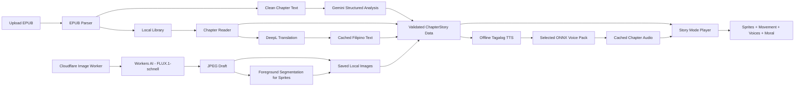

# StoryTale Architecture

## Simple flow



## Main parts

| Part | Short purpose |
| --- | --- |
| Flutter app | Shows dynamic books, chapters, reader, and Story Mode screens. |
| EPUB importer | Accepts `.epub` only and extracts cover, title, author, and chapters. |
| Local storage | Saves EPUBs, progress, translations, chapter data, sprites, and settings on the device. |
| DeepL service | The only translation API. It translates English chapter text into Filipino. |
| Gemini analyzer | Converts one cleaned chapter plus the compact story-bible registry into schema-validated character, dialogue, location, plot, and scene data. |
| Offline TTS engine | Runs a Tagalog ONNX TTS model inside the app without depending on Android voices. |
| Tagalog base model | Uses the Meta MMS Tagalog model, converted to ONNX, to create correctly pronounced source audio. |
| Voice packs | Stores five selected RVC voices as ONNX models installed with the app. Only the active voice is loaded into memory. |
| Audio generator | Creates narration in the background and caches completed chapter audio for smooth playback. |
| Book story bible | Locks recurring character identities, appearances, body/head sprite layers, aliases, locations, and voices across all volumes. |
| ChapterStory data | Stores the sprites, dialogue, movements, sounds, and moral for one chapter. |
| Story Mode player | Moves sprites over backgrounds while playing voices, subtitles, and sound effects. |
| Cloudflare Image Worker | Private, rate-limited endpoint that creates a sprite or background without exposing Cloudflare account credentials. |
| Workers AI | Runs `@cf/black-forest-labs/flux-1-schnell` and returns a JPEG for local storage. |
| Cloudflare Images | Removes sprite backgrounds with foreground segmentation and returns transparent PNG output. |

## Dynamic chapter data

The planned hierarchy is `Book -> Volume -> Chapter -> ChapterStory`. A
single-volume EPUB receives one default volume, while additional EPUBs can be
grouped under the same book. Every chapter can have one `ChapterStory` object:

```text
ChapterStory
- chapterId
- title
- moral
- characters: name, sprite, voiceId
- scenes: background, speaker, subtitle, movement, soundEffect, audioClip
```

The UI reads this data, so we do not create a separate Flutter screen for every book or chapter.

Character identities, aliases, appearances, voices, and locations live in one
book-level story bible so they can be reused across chapters and volumes. See
[Animated Story Mode plan](ANIMATED_STORY_MODE_PLAN.md) for the complete data,
analysis, generation, and validation flow.

## Chosen setup

| Need | Choice |
| --- | --- |
| App data | Local device storage first; no Supabase |
| Translation | DeepL API only |
| Story analysis | Gemini `gemini-3.5-flash` with structured JSON output |
| DeepL allowance | Current account shows 1,000,000 included characters per usage period |
| Filipino target code | `TL` |
| TTS runtime | `sherpa-onnx` / ONNX Runtime inside Flutter |
| Tagalog voice | Meta MMS Tagalog TTS converted to ONNX |
| Character voices | Five selected RVC `.pth` models converted to `.onnx` voice packs |
| Voice processing | On-device, generated before playback, then cached locally |
| Story Mode | Sprites and simple movements |
| Image creation | Cloudflare Workers AI with FLUX.1-schnell |
| Sprite transparency | Cloudflare Images foreground segmentation, then PNG output |
| Image storage | Save accepted sprites and backgrounds on the device |

## On-device voice flow

Current prototype: `tool/run_storytale.ps1` first scans the five raw role
folders, validates each `.pth` plus `.index`/`.model` pair, and creates
fingerprinted chapter audio plus a voice manifest before Flutter starts. RVC
pitch comes from `models/voices/voice_settings.json`; Heroine and Hero default
to `+16`. Web and mobile play those prepared files, so a changed model or pitch
gets a new audio filename instead of reusing browser cache.

```text
Story text
-> optional cached DeepL Filipino translation
-> offline Tagalog TTS model
-> selected RVC ONNX voice pack
-> local audio file
-> Story Mode playback
```

- Voice-Models.com `.pth` files cannot run directly in Flutter; every selected model must pass ONNX conversion and a sound test first.
- The app installs five named voice packs: narrator, heroine, hero, deep character, and elder/extra.
- Generate audio sentence by sentence as a background chapter-preparation job.
- Load one character voice at a time and unload it after its lines are generated.
- Save generated audio so replaying a chapter does not rerun the models.
- If voice preparation fails, normal reading and subtitles remain available.
- Start by proving one voice on the target Android phone, then add the remaining four after measuring speed, memory, storage, and sound quality.

The planned offline runtime is [sherpa-onnx](https://k2-fsa.github.io/sherpa/onnx/flutter/pre-built-app.html). The Tagalog base is [Meta MMS Tagalog TTS](https://huggingface.co/facebook/mms-tts-tgl). RVC voice packs use the project's [ONNX exporter](https://github.com/RVC-Project/Retrieval-based-Voice-Conversion-WebUI/blob/main/infer/modules/onnx/export.py).

## DeepL setup

DeepL supports Tagalog through API target code `TL`. StoryTale sends translation requests only when online, then caches the result. DeepL remains the only translation provider.

## Gemini story analysis

```text
EPUB parser -> cleaned chapter text -> Gemini story-analysis API
-> JSON Schema validation -> structured story data
```

Analysis is per chapter, not one request for the entire book. Each request also
includes a compact approved registry from the book story bible. Gemini may link
an existing character or propose a new candidate, but it cannot replace a
locked appearance, sprite design, or voice. Configuration is documented in
[Environment setup](ENVIRONMENT_SETUP.md).

## Local-first rule

```text
lib/src/features/    feature UI and logic
lib/src/shared/      reusable dynamic widgets
assets/models/tts/   bundled offline Tagalog TTS files
assets/models/voices/ five converted ONNX voice packs
assets/              bundled demo sprites, backgrounds, and sound
app local storage/   uploaded EPUBs and generated chapter content
docs/                short project decisions
```

DeepL remains the only translation provider, Gemini is the story-analysis
provider, and Cloudflare is the image provider. Do not commit API keys or image
Worker tokens. Root `.env` is for a local service only and must not be bundled
into Flutter; a distributed app needs a protected server-side proxy.

See [Cloudflare image generator](CLOUDFLARE_IMAGE_GENERATOR.md) for the setup and test flow.
See [Animated Story Mode plan](ANIMATED_STORY_MODE_PLAN.md) for the volume-aware chapter preparation plan.
