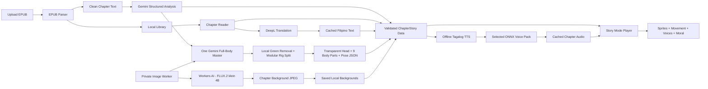

# StoryTale Architecture

## Simple flow



## Main parts

| Part | Short purpose |
| --- | --- |
| Flutter app | Shows dynamic books, chapters, reader, and Story Mode screens. |
| EPUB importer | Accepts `.epub` only and extracts cover, title, author, and chapters. |
| Local storage | Saves EPUBs, progress, translations, chapter data, sprites, and settings on the device. |
| DeepL service | The only translation API. It translates English chapter text into Filipino. |
| Gemini analyzer | Converts one cleaned chapter plus the compact story-bible registry into schema-validated character, dialogue, location, plot, and scene data. |
| Offline TTS engine | Runs a Tagalog ONNX TTS model inside the app without depending on Android voices. |
| Tagalog base model | Uses the Meta MMS Tagalog model, converted to ONNX, to create correctly pronounced source audio. |
| Voice packs | Stores five selected RVC voices as ONNX models installed with the app. Only the active voice is loaded into memory. |
| Audio generator | Creates narration in the background and caches completed chapter audio for smooth playback. |
| Book story bible | Locks recurring character identities, appearances, body/head sprite layers, aliases, locations, and voices across all volumes. |
| ChapterStory data | Stores the sprites, dialogue, movements, sounds, and moral for one chapter. |
| Story Mode player | Moves sprites over backgrounds while playing voices, subtitles, and sound effects. |
| Gemini image model | Uses `gemini-3.1-flash-image` with the proportion, approved-head, and approved-body references to create one master image. |
| Cloudflare Image Worker | Private, rate-limited gateway. It routes sprite requests to Gemini and background requests to Workers AI. |
| Workers AI | Runs `@cf/black-forest-labs/flux-2-klein-4b` and returns a background JPEG. |
| Local sprite processor | Removes the flat green background and prepares the approved head and nine cropped body parts without redrawing them. |
| Sprite Studio | Edits compatible rigs and named poses with precise joint transforms, validated layer rules, and local pose storage. |
| Sprite review | Shows the Gemini source, modular parts, and locally rejoined neutral preview before approval. |

## Dynamic chapter data

The planned hierarchy is `Book -> Volume -> Chapter -> ChapterStory`. A
single-volume EPUB receives one default volume, while additional EPUBs can be
grouped under the same book. Every chapter can have one `ChapterStory` object:

```text
ChapterStory
- chapterId
- title
- moral
- cutscenes: continuous location/time/event groups
- shots: approved layoutId, background, camera preset/target/trigger, and transition
- beats: one short subtitle/audio line in exact source order
- characterLayers: characterId, rigId, poseId, faceProfileId, faceSetId,
  outfitId, stage slot, scale, facing, depth, and movement
```

The UI reads this data, so we do not create a separate Flutter screen for every book or chapter.

`humanoid_v1` is only the bundled demo rig. Each approved generated character
can have its own rig folder and `rigId`, containing its designed body parts,
hair/clothing overlays, face catalog, and compatible poses. Story Mode resolves
those IDs dynamically and falls back to Neutral when a pose or face is missing;
an incompatible rig is hidden while subtitles continue.

Character identities, aliases, appearances, voices, and locations live in one
book-level story bible so they can be reused across chapters and volumes. See
[Animated Story Mode plan](ANIMATED_STORY_MODE_PLAN.md) for the complete data,
analysis, generation, and validation flow. See the
[Visual-Novel Scene Library](ANIMATED_STORY_SCENE_LIBRARY.md) for the approved
shot layouts, movements, subtitle rules, and analyzer choices.

## Chosen setup

| Need | Choice |
| --- | --- |
| App data | Local device storage first; no Supabase |
| Translation | DeepL API only |
| Story analysis | Gemini `gemini-3.5-flash` with structured JSON output |
| DeepL allowance | Current account shows 1,000,000 included characters per usage period |
| Filipino target code | `TL` |
| TTS runtime | `sherpa-onnx` / ONNX Runtime inside Flutter |
| Tagalog voice | Meta MMS Tagalog TTS converted to ONNX |
| Character voices | Five selected RVC `.pth` models converted to `.onnx` voice packs |
| Voice processing | On-device, generated before playback, then cached locally |
| Story Mode | Sprites and simple movements |
| Sprite creation | One Gemini `gemini-3.1-flash-image` master using the locked description and three references |
| Background creation | Cloudflare Workers AI with FLUX.2 klein 4B |
| Sprite transparency | Local green removal; transparent cropped parts use saved positions and joint pivots |
| Image storage | Save accepted sprites and backgrounds on the device |

Gemini API image generation currently requires paid API billing; its free tier
does not include the image models. The project owner pays for generation when
all users share the server-side key, so a public release also needs per-user
quotas and a spending limit. `gemini-3.1-flash-lite-image` is cheaper but is not
the default because the full Flash Image model handles multiple references and
character consistency better.

## On-device voice flow

Current prototype: `tool/run_storytale.ps1` first scans the five raw role
folders, validates each `.pth` plus `.index`/`.model` pair, and creates
fingerprinted chapter audio plus a voice manifest before Flutter starts. RVC
pitch comes from `models/voices/voice_settings.json`; Heroine and Hero default
to `+16`. Web and mobile play those prepared files, so a changed model or pitch
gets a new audio filename instead of reusing browser cache.

```text
Story text
-> optional cached DeepL Filipino translation
-> offline Tagalog TTS model
-> selected RVC ONNX voice pack
-> local audio file
-> Story Mode playback
```

- Voice-Models.com `.pth` files cannot run directly in Flutter; every selected model must pass ONNX conversion and a sound test first.
- The app installs five named voice packs: narrator, heroine, hero, deep character, and elder/extra.
- Generate audio sentence by sentence as a background chapter-preparation job.
- Load one character voice at a time and unload it after its lines are generated.
- Save generated audio so replaying a chapter does not rerun the models.
- If voice preparation fails, normal reading and subtitles remain available.
- Start by proving one voice on the target Android phone, then add the remaining four after measuring speed, memory, storage, and sound quality.

The planned offline runtime is [sherpa-onnx](https://k2-fsa.github.io/sherpa/onnx/flutter/pre-built-app.html). The Tagalog base is [Meta MMS Tagalog TTS](https://huggingface.co/facebook/mms-tts-tgl). RVC voice packs use the project's [ONNX exporter](https://github.com/RVC-Project/Retrieval-based-Voice-Conversion-WebUI/blob/main/infer/modules/onnx/export.py).

## DeepL setup

DeepL supports Tagalog through API target code `TL`. StoryTale sends translation requests only when online, then caches the result. DeepL remains the only translation provider.

## Gemini story analysis

```text
EPUB parser -> cleaned chapter text -> Gemini story-analysis API
-> JSON Schema validation -> structured story data
```

Analysis is per chapter, not one request for the entire book. Each request also
includes a compact approved registry from the book story bible. Gemini may link
an existing character or propose a new candidate, but it cannot replace a
locked appearance, sprite design, or voice. Configuration is documented in
[Environment setup](ENVIRONMENT_SETUP.md).

The validated result is stored in the same structure used by the player:

```text
ChapterStoryData
-> StoryCutsceneData (one location and continuous event)
   -> StoryShotPlanData (layout, background, camera, and character layers)
      -> StoryBeatData (one short subtitle/audio line and optional action)
```

The prototype currently creates this structure deterministically. Gemini will
later fill the same approved fields, so the player does not need a separate AI
code path.

Imported EPUB chapters use this same player and layout resolver. Until Gemini
analysis is requested, StoryTale assigns a varied deterministic set of empty,
solo, pair, and three-character shots; Gemini later replaces only the
structured values, not the Flutter screens or layout code.

The player mirrors the final assembled rig for `left` facing, then applies
approved scale and depth values at the stage level. This leaves Sprite Studio
bones and saved pose coordinates unchanged. During multi-character dialogue,
the current speaker stays fully visible while listeners are softly dimmed.

## Local-first rule

```text
lib/src/features/    feature UI and logic
lib/src/shared/      reusable dynamic widgets
assets/models/tts/   bundled offline Tagalog TTS files
assets/models/voices/ five converted ONNX voice packs
assets/images/characters/rigs/ bundled demo rig parts and pose JSON
assets/              bundled demo sprites, backgrounds, and sound
app local storage/sprite-studio/ reusable custom pose JSON
app local storage/   uploaded EPUBs and generated chapter content
docs/                short project decisions
```

DeepL remains the only translation provider. Gemini analyzes stories and
creates sprites; Cloudflare Workers AI creates backgrounds. The private Worker
keeps the Gemini API key server-side and selects the provider from the request
kind. Do not commit API keys or image Worker tokens. The run script passes only
the Worker URL and prototype client token into Flutter. A distributed app needs
real user authentication and per-user quotas instead of a shared client token.

See [Cloudflare image generator](CLOUDFLARE_IMAGE_GENERATOR.md) for the setup and test flow.
See [Animated Story Mode plan](ANIMATED_STORY_MODE_PLAN.md) for the volume-aware chapter preparation plan.
See [Visual-Novel Scene Library](ANIMATED_STORY_SCENE_LIBRARY.md) for reusable cutscene layouts and prompts.
See [Sprite Studio plan](SPRITE_STUDIO_PLAN.md) for the final rig editor, input, layer, pose storage, and Story Mode integration plan.
