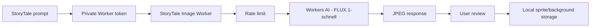

# StoryTale Cloudflare Image Generator

## Part 1 - Plan

1. Use a small Cloudflare Worker as the only public image endpoint.
2. Call Workers AI through the `AI` binding with `@cf/black-forest-labs/flux-1-schnell`.
3. Require a private prototype bearer token and apply a short rate limit before inference.
4. Return a JPEG to StoryTale, let the user review it, then save accepted images locally.
5. Do not store EPUB text, prompts, or generated images in Cloudflare.

## Free allowance

- Workers AI includes 10,000 neurons per day on the Free plan and resets at 00:00 UTC.
- FLUX.1-schnell costs 4.8 neurons per 512x512 tile plus 9.6 neurons per step.
- At four steps, one 512x512 result is roughly 43.2 neurons, or about 230 results per day if no other AI usage consumes the allowance.
- The Worker also uses the normal Workers Free request allowance.

Current official references: [Workers AI pricing](https://developers.cloudflare.com/workers-ai/platform/pricing/), [FLUX.1-schnell](https://developers.cloudflare.com/workers-ai/models/flux-1-schnell/), and [Workers AI limits](https://developers.cloudflare.com/workers-ai/platform/limits/).

## Part 2 - Architecture and setup



Worker folder: `cloudflare/image-worker/`

Deployed endpoint: `https://storytale-image-worker.jbalejoshift0928.workers.dev`

The API stays small:

- `GET /health` checks that the Worker is online.
- `POST /generate` accepts `{"prompt":"...","kind":"sprite"}` or `kind: "background"`.
- `POST /generate` returns raw `image/jpeg` bytes.
- Generation uses four steps to balance speed, quality, and free allowance.

Deploy commands:

```powershell
cd cloudflare/image-worker
npm install
npx wrangler login
npm run cf:types
npm run check
npm run deploy:dry
npm run deploy
npx wrangler secret put APP_TOKEN
```

Never put the token in `wrangler.jsonc`, source code, screenshots, or commits. The Cloudflare login grants Wrangler access through OAuth; no Cloudflare API token is stored in StoryTale.

## Part 3 - Tests

1. `GET /health` must return HTTP 200.
2. `POST /generate` without the bearer token must return HTTP 401.
3. An invalid request must return HTTP 400 without spending AI allowance.
4. An authorized sprite request must return HTTP 200 and `Content-Type: image/jpeg`.
5. Open the saved test image and confirm it is usable before connecting Flutter.

Verified on July 15, 2026:

| Check | Result |
| --- | --- |
| `GET /health` | HTTP 200; authentication configured |
| Generation without token | HTTP 401 |
| Invalid authorized input | HTTP 400; AI was not called |
| Real sprite generation | HTTP 200, `image/jpeg`, 189,878 bytes |
| Visual review | Full-body storybook character on a clean light background |

The test file is at `cloudflare/image-worker/test-output/storytale-test-sprite.jpg`. The folder is ignored by Git.

The active token exists only as a Cloudflare secret and was not printed, committed, or kept in a local file. Rotate it when the Flutter client is connected so the matching client value can be supplied through private build configuration.

## Prototype security note

The bearer token is suitable for a private school prototype, but a value shipped inside a mobile app can be extracted. Before public release, replace the shared token with real user authentication and per-user quotas. Generated JPEGs do not contain transparency, so character sprites may need local background removal or a later transparent-image workflow.
