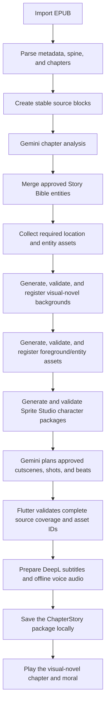

# StoryTale Master Roadmap

This is the single source of truth for StoryTale development order and status.
The architecture and feature plans explain how individual systems work, but
only this file decides what is completed, what is current, and what comes next.

Last reviewed: 2026-08-02

## Status meanings

- **Done**: implemented and suitable as a foundation for later phases.
- **Prototype done**: the reusable system works with bundled or deterministic
  test content, but it is not yet connected to every imported-book asset.
- **Partial**: useful implementation exists, but required work remains.
- **Current**: the only feature phase that should receive the next implementation
  work unless a blocking defect is found.
- **Planned**: not started or not complete enough to become the current phase.

## Product goal

StoryTale is a local-first Flutter EPUB library that supports:

- importing user-owned `.epub` books;
- English reading and DeepL Filipino translation;
- prepared offline narration and character voices;
- a chapter-based visual-novel Story Mode;
- reusable characters, animals, plants, props, and locations;
- simple sprite, camera, and scene movement without video generation; and
- consistent story assets across chapters and volumes.

## Connected system flow

Gemini chooses only approved semantic IDs. Flutter owns coordinates, timing,
animation limits, validation, storage, and safe fallbacks.

## Roadmap summary

| Phase | Status | Result |
| --- | --- | --- |
| 0. Foundation and reusable UI | **Done** | StoryTale app shell, theme, navigation, reusable widgets, routes, and placeholders |
| 1. EPUB import foundation | **Partial** | EPUB picking, validation, metadata, cover, cleaned chapters, and stable text blocks work; permanent library storage and volumes remain |
| 2. Sprite Studio and starter faces | **Prototype done** | Rig selection, bones, poses, layers, five starter actor profiles, modular face sets, and Story Mode loading work |
| 3. Visual-novel runtime and Gemini contract | **Prototype done** | Cutscenes, shots, beats, layouts, facing, depth, camera presets, movement, transitions, and validated Gemini plans work with safe fixtures |
| 4. Story Bible and location requirements | **Done** | Entity extraction, review, automatic approval, specific locations, required background pairs, and the local background catalog work |
| 5. Final visual-novel backgrounds | **Done** | Generate, validate, register, resolve, refresh, and render exact location/state backgrounds with a read-only result catalog |
| 6. Volume analysis and foreground inventory | **Done** | Analyze all chapters through one resumable job, prepare reusable non-human assets, connect them to stories, and show read-only results while management stays developer-only |
| 7. Generated book-specific humans | **Current** | Phase 7G proved the package structure but failed exact visual fidelity; Phase 7G.1 now builds actor hair catalogs, local skin-tone tinting, and generated face, clothing, and accessory layers on locked base geometry |
| 8. Persistent books and volumes | **Planned** | Save EPUBs, books, progress, story bibles, assets, jobs, and `Book -> Volume -> Chapter` data across restarts after the generated-character gate passes |
| 9. Complete ChapterStory builder | **Planned** | Assemble approved assets, exact text coverage, subtitles, moral, movement, and manifests for any imported chapter |
| 10. DeepL and offline audio | **Planned** | Real DeepL caching, Tagalog ONNX TTS, five tested voice packs, prepared line audio, and playback synchronization |
| 11. MVP integration and release validation | **Planned** | Multi-volume tests, interrupted-job recovery, physical Android benchmarks, accessibility, storage cleanup, and failure tests |

## Completed foundations

### Phase 0 - Foundation and reusable UI

Completed:

- StoryTale naming and Poppins typography
- reusable app shell and four-item bottom navigation
- reusable book, chapter, progress, empty-state, and placeholder widgets
- onboarding, Library, Search, Book Details, Reader, Audio, Profile, Sprite
  Studio, Story Bible, generated-asset catalog, and Story Mode routes
- dynamic demo data and responsive Flutter layouts

Remaining UI polish belongs to the feature phase that owns the data. A visible
screen does not mean its real provider, persistence, or error handling is done.

### Phase 1 - EPUB import foundation

Completed:

- `.epub`-only file selection and validation
- local metadata, author, cover, table-of-contents, and chapter parsing
- HTML cleanup and readable chapter extraction
- stable source-block IDs for analysis
- imported books available to the current Library, Reader, Audio, and Story
  preparation session
- imported books, chapters, and stable source blocks now survive a restart in
  local storage, together with reading progress, bookmarks, cached translated
  text, the last-open position, and reader settings
- chapter illustrations are extracted at import, shrunk once, anchored between
  the surrounding paragraphs, and drawn inline in the reader at no more than
  about seventy percent of the screen height, with tap-to-zoom
- artwork on pages the table of contents omits, such as colour galleries, is
  recovered by walking the spine and handed to the chapter it precedes, without
  changing chapter identity, IDs, or source blocks
- covers are shrunk to a thumbnail at import so they always survive a restart
- the reader offers a scrolling mode and a page-by-page mode; pages are packed
  from the existing source blocks, each illustration takes its own page, and
  the single progress fraction carries the reading position across both modes,
  text-size changes, and restarts

Still missing:

- original EPUB byte storage and a chosen local database package
- durable generated image bytes and saved preparation progress
- `Book -> Volume -> Chapter` models and migration
- box-set and separately imported volume grouping
- chapter/volume boundary review for uncertain EPUBs
- duplicate-title and stable-ID migration tests

These items must be complete before Phase 9 can claim persistent ChapterStory
packages, but they do not block the current locked-template character work.

On 4 August 2026 the owner paused Phase 7 and approved one narrow early slice of
Phase 8 so the Week 4 Local EPUB reader milestone is demonstrable: imported
books and reading state are now durable. This slice deliberately stores parsed
chapters rather than raw EPUB bytes, because the web preview keeps these values
in browser local storage. The remaining Phase 8 items below are unchanged, and
Phase 7 resumes from checkpoint `555f07c` afterwards.

### Phase 2 - Sprite Studio and starter faces

Completed prototype:

- alpha-aware mouse, touchpad, and touch selection
- fixed anatomical layer rules
- drag, numeric X/Y/rotation, zoom, Undo, and Redo
- bone controls derived from the rig hierarchy and pivots
- built-in and named reusable pose JSON
- local and development project-default pose saving
- Default, Hero, Heroine, Elder, and Adult face profiles
- modular eyes, nose, mouth, details, reusable face sets, and safe fallbacks
- Story Mode resolution of rig, pose, profile, and face-set IDs

Still missing:

- compatibility validation for multiple humanoid body proportions
- non-humanoid rig editing, which is optional after whole-sprite support works

The core Sprite Studio editor and generated-package loading are complete.
Phase 7G.1 must now prove a locked-template layered appearance package before
Phase 7H may bind book characters into affected ChapterStory data.

### Phase 3 - Visual-novel runtime and Gemini contract

Completed prototype:

- `Chapter -> Cutscene -> Shot -> Beat` data
- zero-, one-, two-, and three-character layouts
- inward facing, whole-rig mirroring, scale, depth, and speaker focus
- camera static, pan, drift, push, pull, snap, and shake presets
- entrance, exit, walking, step, breathing, bob, reaction, and fade movement
- cut, fade, and slide transitions
- short source-preserving subtitle beats
- Worker and Flutter semantic validation
- deterministic fallback when Gemini returns an invalid plan

Still missing:

- validated book-specific layered human packages
- final persistent ChapterStory manifests and synchronized line audio
- full end-to-end testing with arbitrary imported EPUB chapters

### Phase 4 - Story Bible and location requirements

Completed:

- persistent per-book Story Bible records
- typed humans, animals, creatures, plants, props, and locations
- source-backed candidate extraction and alias merging
- automatic approval for high-confidence, conflict-free entities
- manual approve, edit, merge, delete, and type correction
- specific background-ready locations with parent-setting context
- ordered `locationId + backgroundStateId` requirements
- stable local background records, automatic validation/registration, and a
  read-only result catalog

The Story Bible and location-requirement foundation now feeds the completed
landscape background workflow. Broader entity assets remain Phase 6 work.

## Completed background phase

### Phase 5 - Final visual-novel backgrounds

Goal: every approved location/state pair produces a reusable `1024 x 576`
visual-novel environment with open left, center, and right sprite lanes.

Implementation order:

1. Add `VisualNovelBackgroundBrief` with place, parent setting, foreground,
   middle ground, distant background, stage surface, landmarks, safe zones,
   lighting, weather, style, and exclusions.
2. Add one prompt builder that converts only an approved brief and state into
   the provider request.
3. Move the Worker background adapter from square FLUX to a provider that
   accepts explicit `1024 x 576` output.
4. Preserve the returned MIME type and reject corrupt or incorrectly sized
   images.
5. Show the complete uncropped landscape result in the read-only catalog.
6. Automatically register a valid first result; keep retry, regeneration,
   replacement, and discard controls behind the disabled developer flag.
7. Connect each ready asset ID only to the matching
   `locationId + backgroundStateId` cutscenes.
8. Test one imported chapter with multiple places and multiple states of one
   place.

Acceptance checks:

- output is a valid `1024 x 576` image
- the frame shows one continuous, grounded physical environment
- left, center, and right character lanes are usable
- essential landmarks avoid the subtitle-safe lower area
- no person, character, text, UI, floating island, miniature diorama, isolated
  object, or portrait composition appears
- viewing a result never starts another provider request
- unchanged shots reuse one background
- place and state changes use the correct ordered backgrounds

Validated so far:

- the deployed Cloudflare adapter returned a valid `1024 x 576` PNG
- the reviewed sample was a continuous landscape environment without people,
  text, floating islands, or a portrait composition
- automated tests cover corrupt and wrong-sized output rejection
- developer-only replacement tests preserve the current ready background until
  a valid replacement is explicitly accepted
- automated tests cover ordered matching across multiple places and two states
  of one place
- provider output, dimensions, prompt construction, automatic registration,
  read-only catalog display, and ordered key matching pass targeted tests

Playback acceptance defect resolved:

- the repository now exposes exact approved `locationId + stateId` lookup
- successful catalog writes notify an already-open Story Mode page to reload
- failed local catalog writes are reported instead of silently pretending to
  save
- Story Mode also provides a small manual reload action for recovery
- the regression test saves and approves a `1024 x 576` asset while Story Mode
  is already open and confirms that it replaces the fallback

## Completed asset phase

### Phase 6 - Volume analysis and foreground inventory

Status: **Done.**

Phase 6A completed:

- one in-memory preparation job per book/volume and one job per chapter
- source-order analysis of all Little Prince demo chapters
- merged canonical names, aliases, first appearances, chapter appearances,
  speaking chapters, and reusable background requirements
- a minimal Animated Story status view with one progress bar, current chapter,
  elapsed time, ready counts, Pause/Resume, Retry, chapter access, and
  collapsed details
- safe local chapter previews when Gemini is unavailable or one chapter fails
- targeted tests for full-volume preparation, inventory merging, pause/resume,
  and the four-chapter UI flow

Phase 6A is intentionally session-only. Persistent recovery after an app
restart belongs to Phase 8.

Phase 6D therefore uses a lightweight session binary store for generated image
bytes and persists only small metadata. Phase 8 replaces it with durable local
files/database records so generated assets survive an app restart without
putting large Base64 images in SharedPreferences.

Implementation order:

1. **Done:** Add a volume preparation job and one job entry per chapter.
2. **Done:** Add a minimal Animated Story preparation status view with weighted overall
   progress, current stage/chapter, elapsed time, ready chapter count,
   Pause/Resume, Retry, and collapsed optional details.
3. **Done:** Analyze every Little Prince chapter separately and merge results into one
   volume inventory.
4. **Done for the in-memory foundation:** Save canonical names, aliases,
   stable IDs, first appearances, chapter
   appearances, speaking chapters, visual states, and unresolved conflicts.
5. **Done for current background requirements:** Deduplicate recurring entity
   and location/state requirements before any
   image generation.
6. **Done:** Add reusable asset records and approval states for animals,
   creatures, plants, and props. The volume job now creates one stable record
   per required entity variant, preserves its review state, and exposes a
   minimal shared foreground inventory.
7. **Done:** Generate candidates only for recurring, speaking, state-changing,
   or visually important subjects. Gemini creates one whole subject on a
   magenta removal background, StoryTale converts it to a local transparent
   PNG, and the stable inventory record moves to `generated`.
8. **Done - Phase 6D: automatic asset preparation and smooth updates:**
   - repair and validate every required asset's chapter links so a recurring
     record cannot incorrectly show `0 chapters`;
   - build one deduplicated queue containing every missing location background
     plus every required animal, creature, plant, and prop variant;
   - generate the queue automatically after volume analysis, one request at a
     time, while respecting provider limits and reusing existing assets;
   - keep large image bytes outside SharedPreferences and the visible widget
     state during this session so saving a generated result does not freeze the
     app;
   - decode, remove the flat background, and validate dimensions,
     transparency, entity ownership, variant ownership, and stable IDs before
     notifying the UI;
   - automatically register a candidate that passes every deterministic check;
     no approval click is required; and
   - mark only invalid or failed results `needsReview`, retain the safe
     fallback, and show simple queue progress.
9. **Done - Phase 6E: connect prepared assets to ChapterStory:**
   - add a serializable `FocusAssetLayerData` model containing the stable
     entity, asset, and variant IDs plus placement, scale, and depth; keep image
     bytes out of `ChapterStoryData`;
   - build a ready-only scene catalog from the location and foreground
     repositories. An asset is selectable only when its metadata is valid and
     its binary image is available;
   - give Gemini only those stable catalog IDs, require exact
     location/background-state matches, allow at most two source-supported
     foreground layers per shot, and reject unknown or unrelated IDs;
   - resolve and render the selected background and transparent foreground
     bytes in the visual-novel player without copying large bytes into widget
     or preferences state;
   - remove unrelated prototype-human substitution. Missing subjects produce
     an object/location shot or narration-only fallback instead;
   - implement the resolver generically for any imported book and chapter,
     then rebuild Chapter 1 only as the first deterministic fixture. Phase 9
     applies the same resolver to every prepared chapter; and
   - automatically relink/rebuild the fixture after its asset queue completes
     or when Story Mode opens, so the user never has to approve or attach a
     prepared asset manually.
10. **Done - Phase 6E.1: live Chapter 1 stabilization:**
    - trace the complete foreground connection from Story Bible entity,
      generated variant, automatic acceptance, binary bytes, ready catalog,
      `focusAssetLayers`, and final player byte lookup;
    - fix the live Chapter 1 fixture so the Chair appears only during the
      chair action and the Flower appears only when the flower is introduced;
    - replace the repeated demo passage with a short, unique, ordered fixture
      containing one background moment, one chair action, and one flower
      introduction so manual results are unambiguous;
    - require story planning to start a new shot when the active speaker,
      meaningful action, focus subject, location, or background state changes;
    - keep one to three short subtitle beats in a normal fixture shot. Preserve
      every source word in order by continuing a long block in another shot
      instead of placing many lines under one unchanged composition;
    - keep full pose and talking-face changes at beat level in Phase 9. Phase
      6E.1 only guarantees that shot-level composition changes occur at useful
      story moments; and
    - do not start Phase 6F until the generated background, Chair, Flower,
      source order, shot cadence, refresh behavior, and missing-byte fallback
      pass the Chapter 1 manual check.
11. **Done - Phase 6F: read-only asset results with reserved management:**
    - show lightweight previews of automatically accepted assets;
    - keep the normal Foreground Assets and Location Backgrounds pages
      read-only so viewing results never starts another provider request;
    - hide Retry, Regenerate, Replace, Replace PNG, Reuse, and Discard behind
      one disabled developer flag while preserving their implementation for a
      future administration flow; and
    - automatically accept valid first-generation assets. Invalid or failed
      results use the safe fallback and are not retried from the user catalog.

Minimum first-version assets:

- speaking animal/creature: neutral and talking whole sprites
- important silent animal: neutral whole sprite
- plant: normal plus plot-required states only
- prop: normal plus plot-required states only

Safe fallback: approved matching asset, then no-character detail/background
shot, then subtitles/audio. Never use an unrelated human.

The complete orchestration, progress, reuse, readiness, and repair contract is
in [Volume Preparation Plan](VOLUME_PREPARATION_PLAN.md). The provided light
novel EPUB remains deferred; Phase 6 uses the Little Prince fixture first.

### Phase 7 - Generated book-specific humans

Status: **Current.** Phase 7G is a completed structural prototype, but the live
Little Prince result failed the exact-template visual-fidelity gate. Phase
7G.1A provides the local actor, hair, skin-tone, and universal hair-fit
foundation. Phase 7G.1A.1 now persists a complete appearance and explicit
`None` back-hair default per actor; owner manual verification is pending.
**Phase 7G.1B.1 is complete:** the native-size `4096 x 4096`
`character_sheet_v1` guide, fixed crop/anchor manifest, neutral reference,
allowed/protected/seam masks, prompt contract, hashes, and Flutter contract
loader are versioned. **Phase 7G.1B.2 is implemented locally:** Flutter and the
private Worker now share one fingerprinted five-reference 4K request contract,
asset-hash checks, sequential reuse, and provider metadata without automatic
paid retries. The Worker is deployed. The first owner-controlled request on
2026-08-02 returned a Worker 502 before packaging; the Gemini response-format
compatibility fix is deployed, but a second paid request has not been made.
**Phase 7G.1B.3 is implemented locally:** Flutter now validates the
returned sheet and fingerprint, removes green, applies the fixed manifest and
masks, records transparent session layers and stable metadata, rejects invalid
geometry/slots/sides/seams, and assembles the neutral proof over the locked
base. **Phase 7G.1B.4 is implemented locally:** the package uses
the existing rig hierarchy to render four distinct proof PNGs, records their
hashes and validation metadata, exposes six read-only proof groups, and cannot
become `ready` until the four-pose gate passes. The first accepted generated
package is still pending. **Corrective Phase 7G.1B.R2 now has a local-only
`character_sheet_v3` candidate:** it preserves V2's exact Sprite Studio raster
cells while packing front hair plus separate Short, Medium, and Long back-hair
options into one `4096 x 1024` (`4:1`, `2K`) landscape sheet. The checked-in
guide/reference use actor `default`; the manifest retains identical geometry
and actor-specific source mapping for future heroine use. V1, V2, and every
rig/hair source remain unchanged behind their checkpoints. On 2026-08-04 the
owner selected V3 as the future active contract. Flutter, the Worker, and the
provider still use V1 because V3 migration and provider work are paused until
the owner explicitly asks to continue. One offline test,
`test/character_sheet_contract_test.dart`, now hash-guards the V1, V2, and V3
guides, masks, prompts, manifests, and locked rig assets against silent edits
and records the exact remaining V3 migration surface. It registers no asset,
changes no runtime behavior, and makes no provider request. The `4096 x 1024`
`2K` tier remains the minimum supported `4:1` output that preserves the
`800`-pixel-tall Long back-hair cell without resizing. **Corrective Phase
7G.1B.R3 now has a local-only `character_sheet_v4` experiment:** at the owner's
direction it uses `2048 x 512` (`4:1`, `1K`) and uniformly scales all 14
transport cells to `58%` while retaining their exact V3 runtime outputs,
anchors, and seams. V3 remains the exact-size quality fallback. V4 requires
owner guide approval and later full package-fidelity proof; it is not connected
to Flutter, Worker, or Gemini.
Phase 7G.1C is
implemented locally: the processor
hash-locks the ten runtime head/body assets, rejects face pixels outside the
locked head, creates six distinct face proofs plus four face-aware pose proofs,
reuses a matching ready design hash before generation, and the private Worker
no longer applies the shared app limiter to sprite requests. No paid rerun or
test run was performed for this implementation, so owner acceptance remains
pending. The sprite-limiter change is deployed as Worker version
`ed567efb-c4a9-4e76-ad32-f55a2e83d65a`.
Phase 7H Story Mode binding waits for the complete Phase 7G.1 gate.

Implementation order:

1. **Implemented structural proof in Phase 7G:** lock a source-backed design
   brief, call Gemini through the private Worker, remove the flat background,
   create a canonical package, load it in Sprite Studio, and render proof poses.
2. **Phase 7G finding:** generating a complete character first lets Gemini
   redraw the skull and body. Splitting that image afterward cannot restore the
   exact StoryTale template.
3. **Current Phase 7G.1:** freeze the ten total local rig parts (one head plus
   nine body pieces), masks, anchors, and geometry hash. Gemini must not
   generate replacement geometry.
4. **Implemented Phase 7G.1A:** give Default, Hero, Heroine, Elder, and Adult one
   stable actor appearance catalog containing fitted front hair, a back-hair
   catalog, a default hair-style ID, and a default skin-tone value. The current
   Short/Medium/Long back-hair choices remain shared test parts until each
   actor catalog is complete.
5. **Implemented Phase 7G.1A:** add one local skin-tone picker for the locked head and
   nine body pieces. It accepts any opaque RGB/hex color, preserves alpha,
   black line art, and shading through rig-owned skin masks, and never calls an
   image provider.
6. **Implemented Phase 7G.1A.1:** persist each actor's front hair, optional back hair,
   per-style X/Y, and scale. `None` remains a valid default without removing
   other back-hair catalog choices.
7. **Implemented Phase 7G.1B.1:** version the approved `character_sheet_v1` guide,
   assembled neutral reference, exact crop/anchor manifest, allowed/protected/
   seam masks, and prompt contract. Make no paid provider request in this
   subphase.
8. **Local candidate complete in corrective Phase 7G.1B.R:** preserve V1 and
   build `character_sheet_v2` as one 2K sheet whose cells exactly match the
   raster canvases assembled by Sprite Studio. Keep one selected back-hair
   slot, regenerated masks, and no provider request.
9. **Latest local candidate in corrective Phase 7G.1B.R2:** preserve V1/V2 and
   build `character_sheet_v3` as a `4096 x 1024` landscape catalog with one
   front-hair cell and separate Short/Medium/Long back-hair cells. Keep the
   default actor active, record heroine-compatible sources, and stop without a
   provider request. The owner selected V3 on 2026-08-04; migration is paused
   until the owner explicitly resumes it.
10. **Local 1K experiment in corrective Phase 7G.1B.R3:** preserve V1-V3 and
   build `character_sheet_v4` as `2048 x 512` with uniformly `58%` transport
   cells that map back to exact V3 outputs. Stop for owner guide approval with
   no provider request or runtime migration.
11. **Implemented locally in Phase 7G.1B.2 for V1:** request one fixed character sheet
   containing aligned face details, front/back hair, and nine fitted-clothing
   regions without automatic paid retries.
12. **Implemented locally in Phase 7G.1B.3 for V1:** remove green, cut the 14 fixed
   cells, apply allowed/protected/seam masks, register the session package, and
   assemble the neutral full-body proof. Gemini never redraws the body.
13. **Implemented locally in Phase 7G.1B.4 for V1:** compose Idle, Talking, Pointing,
   and Walking from the same layers and add the read-only Character, Layers,
   Faces, Hair, Poses, and Details package proof groups.
14. **Implemented locally in Phase 7G.1C:** compose and validate six faces and four poses on the
   locked rig, then expose Character, Layers, Faces, Poses, and Details proof.
15. **Implemented locally in Phase 7G.1C:** reuse completed components by design hash, remove the
   private sprite route's shared three-per-minute app bottleneck, and keep one
   sequential request active without automatic paid regeneration.
16. **Blocked Phase 7H:** register the validated layered package and rebuild
   every affected ChapterStory so Story Mode uses it across chapters and
   volumes.

Do not regenerate the same character for every scene.

Prototype implemented:

- [x] Create one stable human catalog record per approved Story Bible person.
- [x] Select and persist the reusable actor, face, rig, and existing voice
  mapping without replacing an already approved identity.
- [x] Generate one front-facing Gemini master with the three locked StoryTale
  references.
- [x] Remove the green background locally.
- [x] Split the exact cleaned master into ten provisional image regions.
- [x] Persist provisional hierarchy, pivots, neutral offsets, layer order, and
  advertised pose/face compatibility as metadata.
- [x] Rejoin all parts locally and reject the result if it does not match the
  cleaned master pixel-for-pixel.
- [x] Register stable asset IDs and lock the approved appearance in the Story
  Bible.
- [x] Give Gemini the real book character IDs and locked rig IDs instead of the
  generic prototype actors once the human assets are ready.
- [x] Render generated regions with provisional hard-coded neutral, talking,
  pointing, and walking transforms, including facing and scene movement.
- [x] Add a small read-only Book Characters catalog.

Phase 7G structural correction completed:

- [x] Replace styled references with blank Sprite Studio geometry and anchors.
- [x] Export a runtime package that the normal Sprite Studio loader can open.
- [x] Use the normal rig, pose, and modular-face renderers.
- [x] Add package, face, and pose proof views.
- [ ] **Visual-fidelity correction required:** the whole-character master still
  redraws the base before it is split, so the proof does not yet match the
  locked template.

Current Phase 7G.1 work:

- [ ] Never send a generated head or body to the runtime package.
- [ ] Keep the shared `humanoid_v1` base geometry immutable and versioned.
- [x] **Phase 7G.1A:** add fitted actor-specific front hair and a reusable
  back-hair catalog for Default, Hero, Heroine, Elder, and Adult.
- [x] **Phase 7G.1A:** keep actor identity, hairstyle selection, and skin tone
  in an appearance record shared by every pose, chapter, and later volume.
- [x] **Phase 7G.1A:** use the locked base-part alpha as the V1 rig-owned tint
  mask and add a free RGB/hex color picker
  that recolors all exposed template skin locally without recoloring hair,
  face marks, clothing, white eyes, highlights, or black outlines.
- [x] **Phase 7G.1A:** show compact Actor, Hair, and Skin controls in Sprite
  Studio, with thumbnail selection, current-color swatch, Reset, and a
  neutral fallback when an asset or saved color is invalid.
- [x] **Phase 7G.1A.1:** make `None` a persistent per-actor back-hair default
  and save the selected front/back IDs plus per-style fit values without
  deleting any catalog hair.
- [x] **Phase 7G.1B.1:** version the supplied separated-parts guide and
  add one exact crop/anchor manifest, assembled reference, allowed/protected/
  seam masks, and prompt contract without making a paid request.
- [x] **Corrective Phase 7G.1B.R, local candidate:** preserve V1 and generate a
  `2048 x 2048` V2 guide, masks, manifest, prompt, and reference whose separated
  cells equal the exact raster canvases assembled by Sprite Studio.
- [x] **Corrective Phase 7G.1B.R2, latest local candidate:** preserve V1/V2 and
  generate a `4096 x 1024` V3 landscape guide with one front-hair cell,
  separate Short/Medium/Long back-hair cells, exact body cells, and
  default/heroine actor compatibility metadata.
- [x] **Corrective Phase 7G.1B.R2 owner gate:** V3 is selected and visually
  approved as the future contract. Do not connect it to Flutter, the Worker,
  or Gemini until the owner explicitly asks to resume implementation.
- [x] **Corrective Phase 7G.1B.R3, local candidate:** generate a `2048 x 512`
  V4 1K guide with 14 uniformly `58%` transport cells mapped to exact V3
  runtime outputs, without provider or runtime changes.
- [ ] **Corrective Phase 7G.1B.R3 owner gate:** visually approve V4 and retain
  V3 as the fallback until later package-fidelity proof passes.
- [x] **Phase 7G.1B.2, local implementation:** connect one controlled fixed-sheet provider
  request and response to the versioned contract without automatic retry.
- [x] **Phase 7G.1B.3, local implementation:** produce the fixed-manifest
  cutout/package portion of the `character_sheet_v1` pipeline for modular face
  details, front/back hair, and nine fitted overlays, with a locally assembled
  neutral full-body proof.
- [x] Cut accepted Gemini sheets locally rather than detecting parts with AI.
- [x] Hard-mask, align, validate, cache, and locally compose the neutral proof.
- [x] **Phase 7G.1B.4, local implementation:** compose and review Idle, Talking,
  Pointing, and Walking from the same accepted layers; expose the six read-only
  proof groups; and keep the package out of `ready` until all four proofs pass.
- [ ] Add named held-item anchors and relative layer modes.
- [ ] **Phase 7G.1C owner gate:** prove the Little Prince keeps the exact template head and body in all six
  faces and Idle/Talking/Pointing/Walking.
- [x] Remove or disable the private sprite route's shared three-per-minute
  StoryTale limiter while keeping sequential requests, deduplication, and real
  provider quota errors.

Phase 7G.1A acceptance gate:

- switching actors loads that actor's default face, front hair, optional back
  hair, saved fit, and default skin tone without changing the locked rig
  geometry;
- changing skin tone updates the head and every body part immediately and
  consistently in Idle, Talking, Pointing, and Walking;
- the selected hair IDs, including explicit `None`, fit values, and skin tone
  survive pose changes and are stored once in the appearance manifest rather
  than copied into every pose;
- any valid opaque `#RRGGBB` color is accepted, while invalid saved values fall
  back safely;
- tinting is local and consumes no Gemini or Cloudflare request; and
- Story Mode can later resolve the same `appearanceId` without rebuilding the
  character.

Phase 7G.1A implementation note:

- the appearance record is saved once in local device storage and reapplied
  when the user changes pose;
- one versioned manifest stores a complete front-hair ID, optional back-hair ID,
  skin tone, and per-style fits for all five actors, while migrating the prior
  single-active-actor format;
- each actor currently resolves approved front hair plus an optional fitted
  Short/Medium/Long back-hair choice; actor-specific generated front/back
  artwork is produced in Phase 7G.1B without changing rig geometry; and
- the V1 base artwork alpha is the tint boundary while the face overlay and
  hair layers remain outside the tint operation.

Blocked Phase 7H work:

- [ ] Rebuild and reconnect affected ChapterStory data after a layered human
  becomes ready, for every chapter rather than only Chapter 1.
- [ ] Prove that exact book character appears in Story Mode without an
  unrelated prototype fallback.

The exact Phase 7G.1 layered-package and Phase 7H playback plan is in
[Generated Character Pipeline Plan](GENERATED_CHARACTER_PIPELINE_PLAN.md).
The exact character-sheet request, local split, full-body proof, and package
contract is in [Character Sheet V1 Plan](CHARACTER_SHEET_PLAN.md).
Generated image bytes intentionally remain session-only until Phase 8 replaces
the binary store with durable local files.

### Phase 8 - Persistent books and volumes

Status: **Planned.** Begin only after the Phase 7G.1 layered-character package
and Phase 7H Story Mode binding gates pass.

Implementation order:

1. Choose the local database and file-storage repositories.
2. Add `BookData -> VolumeData -> ChapterData`.
3. Migrate bundled and session books into one default volume.
4. Save original EPUBs, normalized text, metadata, story bibles, approved
   assets, preparation jobs, progress, and settings.
5. Add separately imported volumes to an existing book.
6. Replace the session binary image store with durable local files plus indexed
   metadata containing stable asset ID, owner, variant, MIME type, dimensions,
   checksum, and preparation status.
7. Migrate valid session assets atomically, and treat metadata whose file is
   missing or corrupt as not ready so it can be regenerated safely.
8. Resume interrupted preparation and restore generated backgrounds,
   foregrounds, prepared ChapterStory packages, and queue progress after
   restart without unnecessary regeneration.
9. Make replacement and deletion update metadata and files together, and
   remove only confirmed orphaned generated files.
10. Add storage cleanup that never silently removes original EPUBs or ready
    assets still referenced by a Story Bible or ChapterStory package.

### Phase 9 - Complete ChapterStory builder

Implementation order:

1. Load every validated chapter analysis produced by the volume job.
2. Validate every source block appears exactly once and in order.
3. Resolve every location, background, character, focus asset, pose, face,
   movement, transition, and camera ID.
4. Apply safe fallbacks for missing assets without changing the source text.
5. Create subtitles, optional sound effects, and an editable chapter moral.
6. Write versioned `analysis.json`, `scenes.json`, `subtitles.json`, and
   `manifest.json`.
7. Save resumable preparation states and fingerprints.
8. Mark each valid chapter Story Mode Ready and load its saved package in the
   existing visual-novel player.
9. Complete beat-level playback binding:
   - every beat changes the subtitle and active speaker;
   - neutral speech temporarily uses the talking mouth while strong emotions
     remain visible;
   - `actionId` may change the pose or replay one small movement for that beat;
   - `cameraTriggerBeatId` may trigger one approved snap, shake, or focus
     reaction; and
   - a new shot, rather than every dialogue line, changes the full layout,
     visible cast, background, and primary camera movement.
10. Add timed auto-advance using prepared audio duration when available and a
    readable text-duration fallback otherwise. Previous/Next must continue to
    work without auto-play.
11. Reject or repair packages whose beat speaker, action, camera trigger, or
    source range cannot be resolved. Never replace an unresolved subject with
    an unrelated prototype actor.
12. Replace the normal Prepare Chapter action with Repair/Rebuild for failed,
   stale, or edited chapters.

### Phase 10 - DeepL and offline audio

DeepL:

- use DeepL as the only English-to-Filipino provider
- send target code `TL`
- cache translations by source-text hash
- count usage and avoid repeated requests
- keep original text available on every failure

Offline audio:

- convert and benchmark one Tagalog ONNX TTS base
- run it inside Flutter through the chosen ONNX runtime
- convert, test, and approve one mobile voice pack before adding four more
- keep five roles: narrator, hero, heroine, adult/deep, and elder
- prepare and cache line or short-group audio
- synchronize audio, subtitle beat, speaker, and highlighted text
- rebuild only audio when voice or pitch changes

Background music remains optional and does not block readiness.

### Phase 11 - MVP integration and release validation

Required fixtures:

- one standalone EPUB
- one box-set EPUB
- two separate EPUB volumes joined under one book
- a chapter with one location
- a chapter with multiple locations and a location-state change
- a speaking animal
- an important plant and prop
- missing asset, background, voice, and network failures
- interrupted and resumed chapter preparation

Required validation:

- no source text is omitted, duplicated, summarized, or reordered
- recurring entities retain stable identities, assets, and voices
- normal reading works even when Story Mode preparation fails
- physical Android generation, playback, memory, storage, and battery benchmarks
- reduced-motion, readable subtitles, screen scaling, and error-state checks
- licensing/source records for bundled and generated assets

## Complete remaining-work checklist

### Library and storage

- [ ] permanent EPUB and book repository
- [ ] saved reading/bookmark/preparation progress
- [ ] volume models, grouping, migration, and boundary review
- [ ] resumable jobs and safe storage cleanup

### Translation

- [ ] real DeepL service
- [ ] local translation cache and usage tracking
- [ ] retry and offline behavior

### Voice and audio

- [ ] mobile Tagalog ONNX TTS runtime
- [ ] one benchmarked voice-conversion pack
- [ ] four additional tested packs
- [ ] chapter audio preparation and synchronization

### Backgrounds

- [ ] structured visual-novel brief
- [ ] final prompt builder
- [ ] landscape Worker provider
- [ ] MIME, corruption, and `1024 x 576` validation
- [ ] landscape review/regeneration behavior
- [ ] cutscene asset resolution and multi-location tests

### Foreground entities

- [ ] matching asset generation and approval
- [ ] animals and creatures
- [ ] plants and props with required states
- [ ] focus-asset runtime layers
- [ ] entity-aware analyzer catalogs

### Book-specific humans

- [x] provisional Gemini whole-character generation and stable identity proof
- [x] local transparency cleanup and provisional image-region split
- [x] structural package loading, modular face, and four-pose proof
- [ ] immutable `humanoid_v1` geometry gate
- [ ] generated face, front/back hair, per-part clothing, accessory, and held
  item layers
- [ ] six-face and four-pose layered-composition proof in Sprite Studio
- [ ] locked-template package binding in Story Mode through Phase 7H
- [ ] appearance locking across volumes

### ChapterStory packages

- [ ] exact coverage validator in the final package workflow
- [ ] approved asset resolver and safe fallbacks
- [ ] subtitles, optional SFX, moral, and audio references
- [ ] versioned manifest and local cache
- [ ] saved/resumable preparation and playback progress

### Release readiness

- [ ] full multi-volume fixtures
- [ ] physical Android performance benchmark
- [ ] accessibility and reduced-motion validation
- [ ] licensing review
- [ ] local database, supported-device, and voice-pack decisions

## Open decisions

- local database package and migration strategy
- final landscape background provider if the planned Cloudflare model changes
- sprite and generated-art licensing rules
- the five voice packs that pass mobile conversion and testing
- minimum supported Android hardware

These decisions must be recorded here when resolved.

## Document ownership

| Document | Responsibility |
| --- | --- |
| `PROJECT_HANDOFF.md` | Complete new-chat context: purpose, users, decisions, records, academic requirements, rejected ideas, working agreement, and current handoff state |
| `ROADMAP.md` | Development order, current phase, status, and all remaining work |
| `PROJECT_PLAN.md` | Short overview that links to this roadmap |
| `ARCHITECTURE.md` | Components, providers, data boundaries, and folders |
| `APP_FLOW.md` | User-facing navigation and failure flow |
| `REQUIREMENTS.md` | Product requirements and acceptance expectations |
| `ANIMATED_STORY_MODE_PLAN.md` | Detailed chapter preparation, volume, package, and playback design |
| `VOLUME_PREPARATION_PLAN.md` | Whole-volume job, progress, name/appearance merging, asset reuse, readiness, and repair contract |
| `ANIMATED_STORY_SCENE_LIBRARY.md` | Approved layout, camera, transition, motion, and analyzer IDs |
| `STORY_ANALYSIS_CONTRACT.md` | Gemini input/output and validation boundary |
| `STORY_BIBLE_ENTITY_ASSET_PLAN.md` | Entity types, approval, asset ownership, and safe fallback |
| `VISUAL_NOVEL_BACKGROUND_PLAN.md` | Completed landscape-background implementation contract |
| `SPRITE_STUDIO_PLAN.md` | Rig and pose editor behavior |
| `MODULAR_FACE_SYSTEM_PLAN.md` | Face-part catalogs and set behavior |
| `GENERATED_CHARACTER_PIPELINE_PLAN.md` | Template-constrained Gemini character, real rig, face/pose proof, and Story Mode binding gate |
| `CHARACTER_SHEET_PLAN.md` | Authoritative V1/V2/V3/V4 contracts, 1K transport experiment, landscape hair catalog, Sprite Studio output mapping, local proof pipeline, and Phase 7G.1B acceptance gates |
| `FIXED_HAIR_SLOT_PLAN.md` | Universal per-actor/per-style front/back hair fitting and explicit no-back-hair behavior |
| `CLOUDFLARE_IMAGE_GENERATOR.md` | Worker routes and provider responsibilities |
| `UI_IMPLEMENTATION_PLAN.md` | Responsive screen and reusable-widget reference |
| prompt packs and asset READMEs | Historical production references; they never decide the global next phase |

## Roadmap maintenance rules

1. Only one phase may be marked **Current**.
2. A subsystem plan may describe its own next task, but it must label it as a
   subsystem task and link back to this roadmap.
3. Prototype completion and production completion must remain separate.
4. A phase becomes **Done** only after its acceptance checks pass.
5. When implementation changes status, update this file in the same checkpoint.
6. Do not mark a provider complete because a smoke-test request succeeds.
7. Do not add title-specific rules for The Little Prince or any other fixture.
8. Every imported EPUB must use the same validated contracts and safe fallbacks.
